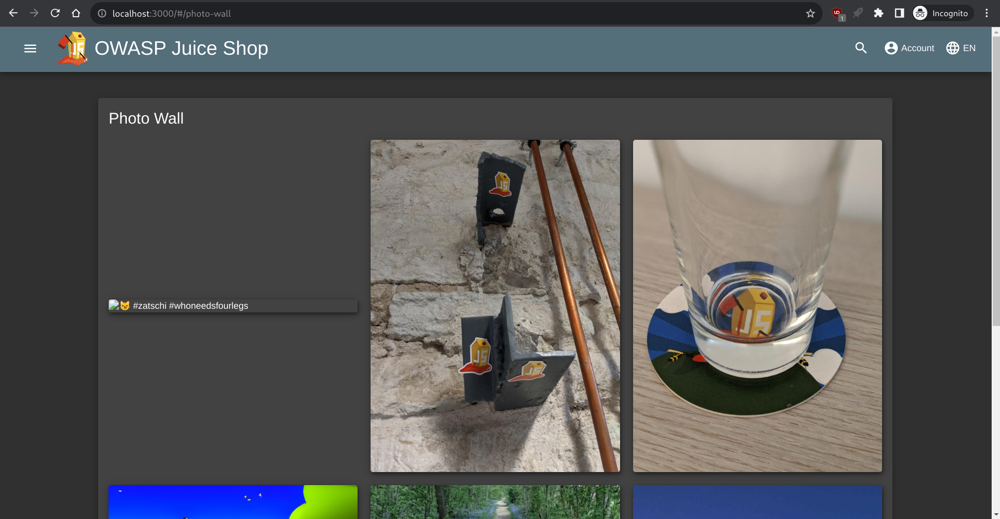
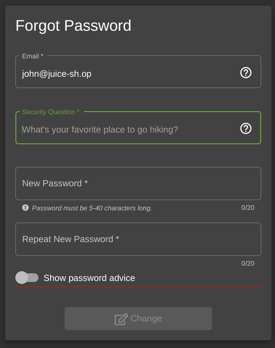

Title: OWASP Juice Shop Sensitive Data Exposure Walkthrough
Preview: A walkthrough for some of the Sensitive Data Exposure problems in OWASP's Juice Shop
Date: 2023-10-03
Tags: nkcyber, cybersecurity

This writeup is to help [NKCyber](https://www.nku.edu/academics/informatics/beyond/student-organizations/nkcyber.html) Club Members walk through the steps for the first few solutions to the Sensitive Data Exposure section of [OWASP Juice Shop](https://owasp.org/www-project-juice-shop/). Similar articles include [instructions for administering OWASP’s Juice Shop](/blog/juice-shop.html) and [last week's XSS solutions](/blog/juice-shop-answers.html).

# Solutions

## Confidential Document

> Access a confidential document. (Difficulty Level: 1)

The description alone doesn't give a lot to work with, so it's worth taking a look at the first hint:

> ```javascript
> /* /ftp directory browsing and file download */
> app.use("/ftp", serveIndexMiddleware, serveIndex("ftp", { icons: true }));
> app.use("/ftp(?!/quarantine)/:file", fileServer());
> app.use("/ftp/quarantine/:file", quarantineServer());
> 
> /* /encryptionkeys directory browsing */
> app.use(
>   "/encryptionkeys",
>   serveIndexMiddleware,
>   serveIndex("encryptionkeys", { icons: true, view: "details" })
> );
> app.use("/encryptionkeys/:file", keyServer());
> 
> /* /logs directory browsing */
> app.use(
>   "/support/logs",
>   serveIndexMiddleware,
>   serveIndex("logs", { icons: true, view: "details" })
> );
> app.use("/support/logs/:file", logFileServer());
> 
> /* Swagger documentation for B2B v2 endpoints */
> app.use("/api-docs", swaggerUi.serve, swaggerUi.setup(swaggerDocument));
> 
> app.use(express.static(path.resolve("frontend/dist/frontend")));
> app.use(cookieParser("kekse"));
> ```

Here, we see a lot of routes defined on an [Express.js](https://expressjs.com/) router, with [app.use](https://expressjs.com/en/4x/api.html#app.use). 

<aside>
**What is Express.js?**

In basic terms, websites have two main parts:
1. The frontend (the HTML, JS, and CSS that your users interact with)
2. The backend (the servers that send the data to the client)

When picking frontend and backend technologies, there are many options to choose from, but many frontends involve writing JavaScript, as it is the most commonly supported language to add interactivity to webpages.
    
It's possible to write the backend in a different language (e.g. Java, C#, Python, Go, etc.), but for convinence it can be nice to keep everything in the same language (i.e. JavaScript).
    
From there, we need to run JavaScript on the backend, which we can do with [Node.js](https://nodejs.org/en), which is based on [the same engine](https://v8.dev/) that makes Chrome execute JavaScript quickly on the frontend.
    
From there, [Express.js](https://expressjs.com/) is a library that makes it simple to create a server in JavaScript.
    
Here is an example web server:

```javascript
const express = require('express') // require the Express.js library
const app = express() // create a server that will respond to requests
const port = 3000 // The port to listen for requests on

// listen on the base route `/` and respond "Hello World!" to all requests
app.get('/', (req, res) => {
  res.send('Hello World!')
})

// actually start the server
app.listen(port, () => {
  console.log(`Example app listening on port ${port}`)
})
```
&mdash; <cite><a href="https://expressjs.com/en/starter/hello-world.html">Hello world example</a></cite> (comments mine)
    
</aside>


For each line that we see `app.use`, we can imagine we're taking some part of the URL, and doing something special when we navigate to that path.

Let's take a look at the first line, for example:

```javascript
app.use("/ftp", serveIndexMiddleware, serveIndex("ftp", { icons: true }));
```

The `app` (defined elsewhere) will match all routes starting with `/ftp`, and then serve an index of all of the files to the user. Then, it will call some function [`serveIndex`](https://www.npmjs.com/package/serve-index) with the parameter `"ftp"`. We can look up that function, and find where it came from.

Looking at the npm page for [serve-index](https://www.npmjs.com/package/serve-index):

> The `path` is based off the `req.url` value, so a `req.url` of `'/some/dir` with a `path` of `'public'` will look at `'public/some/dir'`. If you are using something like `express`, you can change the URL "base" with `app.use` (see the express example).

So, great! Let's try going to `/ftp` on the server, and seeing what happens.


Woah, neat! It creates an index of all of the files on the FTP server. 

Some of them are pretty boring. Here's `legal.md`, for example:

```
# Legal Information

Lorem ipsum dolor sit amet, consetetur sadipscing elitr, sed diam nonumy
eirmod tempor invidunt ut labore et dolore magna aliquyam erat, sed diam
voluptua. At vero eos et accusam et justo duo dolores et ea rebum. Stet
clita kasd gubergren, no sea takimata sanctus est Lorem ipsum dolor sit
... [document continues]
```

However, one document in particular stands out, `acquisitions.md`:

```
# Planned Acquisitions

> This document is confidential! Do not distribute!
... [document continues]
```

This seems like the confidential document.

Once we have requested this file, we can return to the home page at `/`.

From there, we should get our flag for the challenge Confidential Document.

## Exposed Metrics

> Find the endpoint that serves usage data to be scraped by [a popular monitoring system](https://github.com/prometheus/prometheus). (Difficulty Level: 1)

Looking at the problem description, I saw that there was a link to the Prometheus monitoring tool, which I had never heard of before.

I searched "where is prometheus default endpoint" on Google, and got the featured snippet:

> Starting Prometheus 
> You can also verify that Prometheus is serving metrics about itself by navigating to its own metrics endpoint: http**://localhost:9090/metrics**.
>
> &mdash; <cite><a href="https://prometheus.io/docs/introduction/first_steps/#:~:text=Starting%20Prometheus,-To%20start%20Prometheus&text=You%20can%20also%20verify%20that,%3A%2F%2Flocalhost%3A9090%2Fmetrics.">Prometheus.io</a></cite>

So, I went to `/metrics`, and got the flag.

Looking through the code they provided in the hint, we can find the route defined on line 4.

<details>
<summary>See full code</summary>   
```typescript
/* Serve metrics */
let metricsUpdateLoop: any;
const Metrics = metrics.observeMetrics();
app.get("/metrics", metrics.serveMetrics());
errorhandler.title = `${config.get(
  "application.name"
)} (Express ${utils.version("express")})`;

const registerWebsocketEvents = require("./lib/startup/registerWebsocketEvents");
const customizeApplication = require("./lib/startup/customizeApplication");

export async function start(readyCallback: any) {
  const datacreatorEnd = startupGauge.startTimer({ task: "datacreator" });
  await sequelize.sync({ force: true });
  await datacreator();
  datacreatorEnd();
  const port = process.env.PORT ?? config.get("server.port");
  process.env.BASE_PATH =
    process.env.BASE_PATH ?? config.get("server.basePath");

  metricsUpdateLoop = Metrics.updateLoop();

  server.listen(port, () => {
    logger.info(
      colors.cyan(`Server listening on port ${colors.bold(`${port}`)}`)
    );
    startupGauge.set({ task: "ready" }, (Date.now() - startTime) / 1000);
    if (process.env.BASE_PATH !== "") {
      logger.info(
        colors.cyan(
          `Server using proxy base path ${colors.bold(
            `${process.env.BASE_PATH}`
          )} for redirects`
        )
      );
    }
    registerWebsocketEvents(server);
    if (readyCallback) {
      readyCallback();
    }
  });
}

export function close(exitCode: number | undefined) {
  if (server) {
    clearInterval(metricsUpdateLoop);
    server.close();
  }
  if (exitCode !== undefined) {
    process.exit(exitCode);
  }
}
```

</details>

```typescript
app.get("/metrics", metrics.serveMetrics());
```

Once we see that the server routes to that path, we know we can visit it.

From there, we can navigate back to the homepage to get the flag.

## Meta Geo Stalking

> Determine the answer to John's security question by looking at an upload of him to the Photo Wall and use it to reset his password via the Forgot Password mechanism. (Difficulty Level: 2)

To start this challenge, I went to the Photo Wall:



Looking through the gallery of happy juice connoisseurs, we stumble upon a post by j0hNny, who very well might be the John from the problem description:


Okay, so let's go to the Forgot Password page, and see what information we need to find from this image.

First, we can enter John's email: `john@juice-sh.op`.



It looks like John has selected "What's your favorite place to go hiking?" as his security question, and then conveniently posted a picture of him going hiking.

Now we just need to figure out where this photo was taken.

Unfortunately, [Rainbolt](https://www.youtube.com/@georainbolt) seems to be too busy to figure this one out, and I'm not very good at GeoGuessr. We're going to have to inspect the image he's posted more carefully.

Luckily, there's more to an image than just the visuals. Many common file types (including `.jpg`, `.png`, `.webp`, and more) include  something called [Exif data](https://en.wikipedia.org/wiki/Exif) which stores additional information about the image, including camera settings, image metrics, date and time information, and potentially the geolocation where the image was taken.

Using your provided Kali VM, you may note that [`exiv2`](https://www.kali.org/tools/exiv2/) is installed, which is a special tool for managing image metadata.

You can use it to analyze more information about the image John posted:

```bash
$ # First, ensure that exiv2 is installed
$ which exiv2
/usr/bin/exiv2
$ # Then, download John's image
$ wget http://localhost:3000/assets/public/images/uploads/favorite-hiking-place.png
[...output ommitted...]
$ # Finally, get all of the Exif data from the image
$ exiv2 -g GPS favorite-hiking-place.png
Exif.Image.GPSTag                            Long        1  50
Exif.GPSInfo.GPSVersionID                    Byte        4  2.2.0.0
Exif.GPSInfo.GPSLatitudeRef                  Ascii       2  North
Exif.GPSInfo.GPSLatitude                     Rational    3  36deg 58' 0"
Exif.GPSInfo.GPSLongitudeRef                 Ascii       1  West
Exif.GPSInfo.GPSLongitude                    Rational    3  84deg 21' 0"
Exif.GPSInfo.GPSMapDatum                     Ascii       6  WGS-84
```

You can also use `identify` from [ImageMagick](https://imagemagick.org/):

```bash
$ # ensure identify is installed
$ which identify
/usr/bin/identify
$ identify -verbose favorite-hiking-place.png | grep GPS
    exif:GPSInfo: 50
    exif:GPSLatitude: 36/1, 57523/1000, 0/1
    exif:GPSLatitudeRef: N
    exif:GPSLongitude: 84/1, 20893/1000, 0/1
    exif:GPSLongitudeRef: W
    exif:GPSMapDatum: WGS-84
    exif:GPSVersionID: ....
```

Either way works, and it gives us the coordinates `36°58'0"N 84°21'0"W` ([view on Google Maps](https://maps.app.goo.gl/rCqd4qk7W7sRomsMA)).

This is part of Daniel Boone National Forest. (Super beautiful place btw. I can totally recommend it.)

I got lucky that John had the same taste in capitalization as Google Maps, but I imagine there are quite a number of possible locations that one might want to enter.

Either way, this is a good reminder of how security questions rely on information that can be deduced or leaked, and are not very secure.

Also, it's important to automatically strip exif location data from user images before hosting them publicly. Almost all social media websites do this automatically.

## Poison Null Byte

> Bypass a security control with a <a href="https://www.martellosecurity.com/kb/mitre/cwe/626/#description">Poison Null Byte</a> to access a file not meant for your eyes. (Difficulty Level: 4)

From the linked definition:

> A null byte (NUL character) can have different meanings across representations or languages. For example, it is a string terminator in standard C libraries, but Perl and PHP strings do not treat it as a terminator. When two representations are crossed - such as when Perl or PHP invokes underlying C functionality - this can produce an interaction error with unexpected results. Similar issues have been reported for ASP. Other interpreters written in C might also be affected.
>
> The poison null byte is frequently useful in path traversal attacks by terminating hard-coded extensions that are added to a filename. It can play a role in regular expression processing in PHP.
>
> &mdash; <cite><a href="https://www.martellosecurity.com/kb/mitre/cwe/626/#description">Null Byte Interaction Error (Poison Null Byte) - Martello Security</a></cite>

Because basically, when we go to a URL, we are requesting a resource with a certain name. Whether we can see that resource depends on if it ends in `.md` or `.pdf`. So, the null byte is a tool we can use to create a separation between the resource we're requesting and what the string ends with, such that we can bypass checks for file extensions.

Here are two examples:

## Forgotten Sales Backup

> Access a salesman's forgotten backup file. (Difficulty Level: 4)

It's great to keep backups! It's not great for random people to be able to steal your backups.

This begins similarly to the Confidential Document challenge, shown [above](#confidential-document).

Let's look back at our ftp server:


In particular, we're looking for a sales backup.

Out of all the files here, it looks like two could be backups:

- `coupons_2013.md.bak`
- `package.json.bak`

Of those, the `package.json.bak` doesn't look like something related to a salesperson, so let's take a look at `coupons_2013.md.bak`.


Ah, it looks like we're not allowed to view `.bak` files. So, we somehow need to convince the server that we're accessing a `.md` or `.pdf` file, when we're actually requesting the `.md.bak` file.

Using the technique from the Poison Null Byte challenge, we can start by identifying the resource we want to download. In this case, that's `/ftp/coupons_2013.md.bak`.

Now, we append a file extension that is allowed, and join it with a null byte: `/ftp/coupons_2013.md.bak%00.pdf`

Next, we [URL encode](https://developer.mozilla.org/en-US/docs/Glossary/Percent-encoding) the percent sign: `/ftp/coupons_2013.md.bak%2500.pdf`.

Finally, we can download the file to get our flag:

```bash
$ wget http://localhost:3000/ftp/coupons_2013.md.bak%2500.pdf -O coupons_2013.md
```

Note that you will have to go back to the Juice Shop index to see your flag for this challenge.

You should see the flag for the Poison Null Byte challenge as well.

## Forgotten Developer Backup

Using the exact same technique, we can simply do:

```bash
$ wget http://localhost:3000/ftp/package.json.bak%2500.md -O package.json.bak
```

to complete this challenge.

# Conclusion

Congratulations! 🎉

I hope you learned something new today. 

Come back next week for our foreign exchange meeting, where we'll be learning more about other injection techniques.

As always, feel free to [reach out to me](https://zack.fyi/contact.html) with feedback about this week's lesson. Thanks! 😊