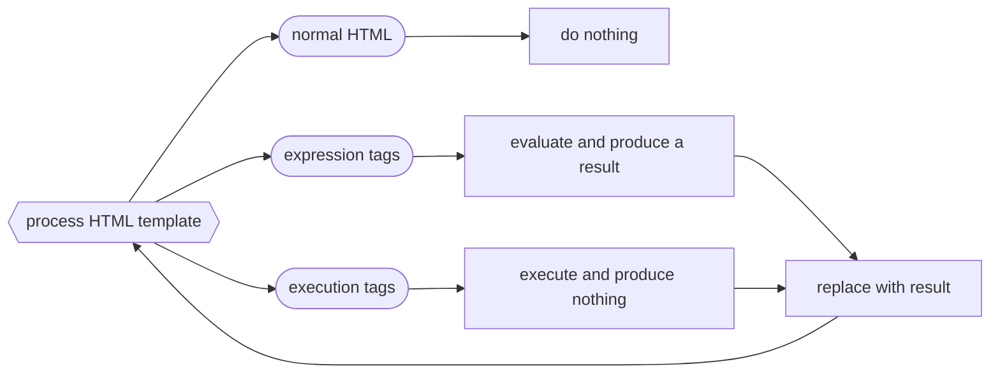

Title: PyHP: Python Home Page
Preview: What if we used Python's eval and exec as HTML template generators?
Date: 2023-06-17
Tags: python

## Introduction

<aside>
All the code for this project is [on Github](https://github.com/zsarge/PyHP). (There's not really that much.)
</aside>

So, the other day, I was at [a local Python meetup](https://cincypy.com/), where one of the members shared an interesting project prompt:

**Create a minimalist static site generator using only the Python standard library.**

Of course, one option is to just write a tokenizer and parser from scratch, parsing your template language of choice quickly and efficiently. This has the merit of being the most technically challenging way to approach this that I can think of, and would allow for boundless creativity. However, this approach seems to carry a significant scope of work for a fun hobby project.

The person who introduced the prompt took it in an interesting direction, using Python's native XML parsing capabilities to generate documents which were then output as XHTML, championing XML's validity in 2023. I like this approach, as I believe it was a good learning experience regarding Python's XML support, though he said that he did end up writing a significant amount of error-checking code for invalid XML structures.

On the other hand, I felt inspired to take this approach in an ultra-minimalist direction: Using the Python parser itself to handle my templates.

## Inspiration from Ruby

It was interesting to me to see what is required to build this type of project in Python, as, in my experience, Ruby makes this type of project trivial. The site you're reading right now is generated by a bodged-together static site generator I wrote using Ruby's standard library.

Notably, Ruby's standard library includes the templating system [ERB](https://en.wikipedia.org/wiki/ERuby), so including a template is as simple as including just a few lines.

ERB has two main features that let you use Ruby code to produce HTML:

1. Execution tags
   - Used for loops, comments, if statements, function definitions, and anything that shouldn't end up in the result.
2. Expression tags
   - Used to produce values for your HTML

```ruby
require 'erb'
template = ERB.new("
<% 1.upto(3) do |i| %>  <%# execution tag  %>
   <h<%= i %>>          <%# expression tag %>
    <%= phrase %>       <%# expression tag %>
   </h<%= i %>>         <%# expression tag %>
<% end %>               <%# execution tag  %>
")
phrase = "Hello World" # the variable used in the template above
puts template.result(binding)
```

With whitespace removed, this produces:

```html
<h1>Hello World</h1>
<h2>Hello World</h2>
<h3>Hello World</h3>
```

## PHP Inspiration

As a disclaimer, I really haven't used PHP very much, so I didn't take any influences in PyHP, beyond the name. Originally, I wanted to call this PHP as well, but I found it caused more confusion than laughs.

## My Solution

While it's totally possible to try to build out a full static site generator under this prompt, I was mostly inspired to find an elegant, minimalist solution to produce basic templates.

However, because I'm working in Python, I choose to loosely base the project on [Jinja templates](https://palletsprojects.com/p/jinja/):

|   Syntax    | Description    |
| :---------: | :------------- |
| `{{ ... }}` | expression tag |
| `` | execution tag  |

In general, I figured the flow should go as follows:

<style>
img {
   max-width: 100%;
}
</style>



Given this framework, Python gives us two really useful tools for processing strings as Python code, and they happen to be exactly what we want!

|    Function    | Description                            |
| :------------: | :------------------------------------- |
| [`eval`][eval] | evaluate a string, and return a result |
| [`exec`][exec] | execute a string tag                   |

[eval]: https://docs.python.org/3/library/functions.html#eval
[exec]: https://docs.python.org/3/library/functions.html#exec

Basic usage is as follows:

```py
# eval returns native Python types
x = eval("1 + 2")
assert type(x) is int and x == 3
# exec has side effects
exec("x += 1")
exec("print(x)")  # => prints 4

def f(x):
    return x * 2
# eval and exec can be called recursively
arr = eval("[eval('f(i)') for i in range(x)]")
print(arr) # => prints [0, 2, 4, 6]
```

`exec` and `eval` both take three parameters:

1. The code we're executing
2. the **global** definitions the code has access to
3. the **local** definitions the code has access to

In our case, we want to be able to call global functions with ease, so we pass in all `globals()` for parameter 2. We also want to be able to define new methods and variables on the fly, so we pass in a shared namespace for all templates as well.

Based on this reasoning, we get the following core solution:

```py
EXECUTE_REGEX = re.compile(r'\{\%(.*?)\%\}', re.DOTALL)
EVALUATE_REGEX = re.compile(r'\{\{(.*?)\}\}', re.DOTALL)
template_namespace = {}

def parse(template: str) -> str:
    def make_replacer(handler: Callable) -> Callable[[str], str]:
        def replace(match: Match) -> str:
            # extract the code inside the template
            code = str(match[1]).strip()
            # recursively parse, then execute that code
            return str(handler(parse(code), globals(), template_namespace) or "")
        return replace

    executor = make_replacer(exec)
    evaluator = make_replacer(eval)

    # execute everything between '' and replace it with nothing
    template = EXECUTE_REGEX.sub(executor, template)

    # evaluate everything between '{{' and '}}' and recursively replace it with its result
    return EVALUATE_REGEX.sub(evaluator, template)
```

[(Source on Github)](https://github.com/zsarge/PyHP/blob/51d26dfb5ba921d77f85d312d71b64905ed25809/src/main.py#LL11C1-L25C51)

I felt like this was a pretty elegant solution to this prompt.

Let's see what it can do!

## Examples
